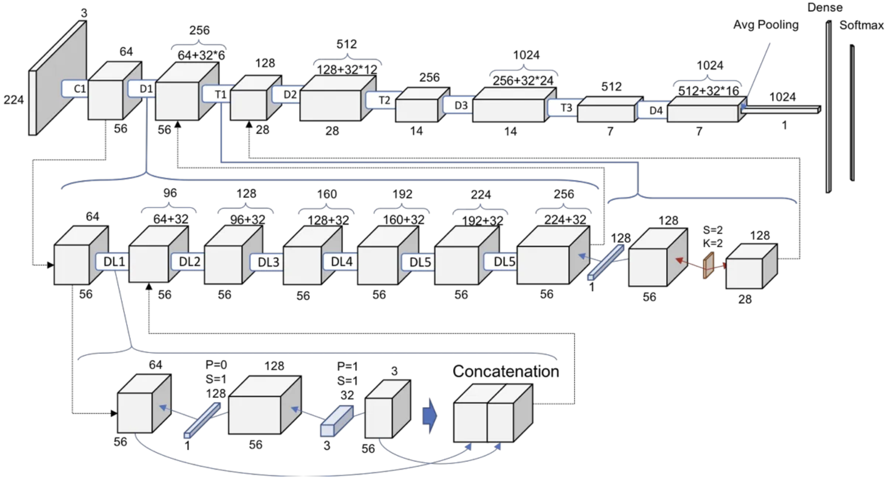

# Densely Connected Convolutional Networks (DenseNet)

## Model Name and Publication Year
- **Full Name:** Densely Connected Convolutional Networks (DenseNet)  
- **Publication Year:** 2017  
- **Presented at:** CVPR 2017 (Computer Vision and Pattern Recognition)  

## Paper Details and Authors
- **Authors:** Gao Huang, Zhuang Liu, Laurens van der Maaten, Kilian Q. Weinberger  
- **Publication:** "Densely Connected Convolutional Networks"  
- **Citation:** Huang, G., Liu, Z., Van Der Maaten, L., & Weinberger, K. Q. (2017). Densely connected convolutional networks. In Proceedings of the IEEE conference on computer vision and pattern recognition (pp. 4700-4708).  
- **[Original Paper](https://arxiv.org/abs/1608.06993)**  

## Concise Summary of Key Contributions
DenseNet introduced a novel connectivity pattern where each layer is directly connected to every other layer in a feed-forward fashion. This dense connectivity:
- Alleviates the **vanishing-gradient problem**
- Strengthens **feature propagation**
- Encourages **feature reuse**
- Substantially **reduces the number of parameters**  
DenseNets achieved state-of-the-art performance on multiple image classification benchmarks while requiring fewer parameters than comparable architectures.

## Architectural Details
### Core Innovation: **Dense Block**
Unlike traditional CNNs where each layer is connected only to the previous and next layers, in DenseNet, each layer receives inputs from all preceding layers and passes its feature maps to all subsequent layers within the same dense block.

```
Input
  |
  ↓
[Conv Layer 1] -------+
  |                   |
  ↓                   ↓
[Conv Layer 2] ----+  |
  |                |  |
  ↓                ↓  ↓
[Conv Layer 3] --+ |  |
  |              | |  |
  ↓              ↓ ↓  ↓
[Conv Layer 4] -- + +  +
  |                    
  ↓                    
Output                
```

### Network Architecture
- **Initial Convolution Layer:** 7×7 conv with stride 2
- **Dense Blocks:** 3-6 dense blocks depending on the network depth
- **Transition Layers:** Between dense blocks for downsampling:
  - Batch Normalization
  - 1×1 Convolution (for channel reduction)
  - 2×2 Average Pooling
- **Final Classification Layer:** Global Average Pooling followed by a fully-connected layer

### DenseNet Variants:
- **DenseNet-121:** 6, 12, 24, 16 layers in each dense block
- **DenseNet-169:** 6, 12, 32, 32 layers in each dense block
- **DenseNet-201:** 6, 12, 48, 32 layers in each dense block
- **DenseNet-264:** 6, 12, 64, 48 layers in each dense block
  

### Growth Rate
- The "growth rate" (**k**) controls how many new features each layer contributes.
- Typical values: **k=12, k=24, k=32**.
- Despite the small growth rate, each layer has access to all previously created features within the block.

## Key Innovations
- **Dense Connectivity Pattern:** Each layer is connected to every other layer within a dense block, creating short paths from early layers to later layers.
- **Feature Reuse:** Later layers can access and reuse features learned by earlier layers, leading to more efficient feature extraction.
- **Improved Gradient Flow:** Short connections provide direct paths for information and gradient flow, making the network easier to train.
- **Compact Models:** DenseNets require fewer parameters than traditional CNNs for the same level of performance.
- **Bottleneck Layers:** DenseNet-B variants include **1×1 convolutions** before each 3×3 convolution to improve efficiency.
- **Transition Layers:** Reduce spatial dimensions between dense blocks using pooling and feature map compression.

## Relationship to Vision Transformers
DenseNet preceded **Vision Transformers (ViT)** but shares some key similarities:
- **Information Flow:** DenseNet uses dense connectivity, while ViT uses self-attention mechanisms.
- **Feature Interaction:** DenseNet allows features from different layers to interact via concatenation, ViT via attention.
- **Parameter Efficiency:** DenseNet uses feature reuse, ViT uses weight sharing.
- **Modern Hybrids:** Some architectures blend DenseNet with transformer ideas:
  - **CvT (Convolutional Vision Transformer)**
  - **ConViT (Convolutional Vision Transformer)**

## Code Snippets and Implementation

## Popular Implementations
- **PyTorch:** `torchvision.models.densenet`
- **TensorFlow/Keras:** `tf.keras.applications.DenseNet121`
- **Original Lua Implementation:** [liuzhuang13/DenseNet](https://github.com/liuzhuang13/DenseNet)

## Further Reading Suggestions
- **EfficientNet (2019)** - Optimized CNN scaling.
- **ConvNeXt (2022)** - A modernized CNN with transformer-inspired elements.
- **PVT (2021)** - A transformer-based CNN replacement.
