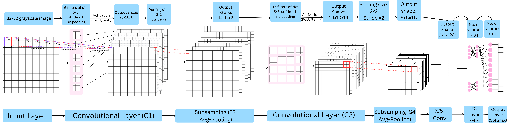

# LeNet (1998)

## Paper Details and Authors
**Title:** Gradient-Based Learning Applied to Document Recognition  
**Authors:** Yann LeCun, Léon Bottou, Yoshua Bengio, Patrick Haffner  
**Publication:** Proceedings of the IEEE, 86(11), 2278-2324  
[Link to Original Paper](https://ieeexplore.ieee.org/document/726791)

---

## Summary of Key Contributions
LeNet, specifically LeNet-5, was one of the earliest Convolutional Neural Networks (CNNs) that demonstrated remarkable success in handwritten digit recognition. The paper introduced several foundational concepts that would become core to modern deep learning approaches:

- A multi-layer architecture with convolutional layers for feature extraction.
- The use of shared weights and local receptive fields to exploit spatial invariance.
- Subsampling (pooling) layers to reduce dimensionality while maintaining spatial information.
- End-to-end training using backpropagation for a complete recognition system.

The architecture achieved state-of-the-art performance on the MNIST dataset and was successfully deployed in real-world applications, including reading handwritten digits on checks for the U.S. Postal Service.

---

## Architectural Details
LeNet-5 consists of seven layers (not counting the input):

- **Input Layer:** 32×32 grayscale image  
- **C1:** Convolutional layer with 6 feature maps, 5×5 convolution kernels (28×28 output)  
- **S2:** Subsampling (average pooling) layer with 2×2 filters (14×14 output)  
- **C3:** Convolutional layer with 16 feature maps, 5×5 convolution kernels (10×10 output)  
- **S4:** Subsampling (average pooling) layer with 2×2 filters (5×5 output)  
- **C5:** Convolutional layer with 120 feature maps, 5×5 convolution kernels (1×1 output)  
- **F6:** Fully connected layer with 84 units  
- **Output:** Fully connected layer with 10 units (one per digit class)  

A unique aspect of the C3 layer is that not all S2 feature maps connect to all C3 feature maps, creating a non-complete connectivity pattern that reduces complexity and forces different feature maps to extract different features.

---

## Key Innovations
- **Convolutional Layers:** Introduced trainable convolutional filters for automatic feature extraction, eliminating the need for hand-crafted feature engineering.
- **Parameter Sharing:** By sharing weights across different positions in an image, the model drastically reduced the number of parameters while maintaining expressiveness.
- **Subsampling:** Incorporated dimensionality reduction through pooling operations, increasing robustness to slight input deformations.
- **Sigmoid Squashing Functions:** Used tanh activation functions for non-linearity.
- **End-to-End Learning System:** Demonstrated that a complete system from raw pixels to final classification could be jointly trained using backpropagation.
- **Sparse Connection Matrix:** Implemented a selective connectivity pattern between certain layers to improve computational efficiency and encourage feature diversity.

---

## Relationship to Vision Transformers
While LeNet and Vision Transformers represent very different approaches to computer vision, LeNet established several foundations that influenced all subsequent vision models, including ViTs:

- **Hierarchical Feature Learning:** LeNet established the paradigm of learning increasingly complex features in successive layers, a concept that remains central to deep learning. ViTs approach this differently through self-attention across patches but still maintain the principle of hierarchical abstraction.
- **End-to-End Training:** LeNet demonstrated the power of end-to-end training from raw pixels to classification output, a principle that ViTs fully embrace.
- **Spatial Information Processing:** LeNet introduced the idea of explicitly processing spatial information through convolutions. ViTs replace this with position embeddings and self-attention.
- **Contrast in Inductive Bias:** LeNet's architecture incorporated strong inductive biases about the nature of images (locality, translation invariance) through convolutions. ViTs represent a departure from this approach, using much weaker inductive biases and relying on data and scale to learn relevant patterns.
- **Evolution of Receptive Fields:** LeNet built up receptive fields gradually through a sequence of convolutional layers. ViTs radically reimagined this by allowing global receptive fields from the very first layer through self-attention.

LeNet's success validated the idea that networks could learn useful visual representations directly from data, setting the stage for the deep learning revolution that eventually led to transformers.

---

## Code Implementation

---

## Further Reading
- **[Backpropagation Applied to Handwritten Zip Code Recognition](https://ieeexplore.ieee.org/document/6795724)** - LeCun, Y., et al. (1989). An earlier paper that introduced some of the concepts that would evolve into LeNet.
- **[Best Practices for Convolutional Neural Networks Applied to Visual Document Analysis](https://www.microsoft.com/en-us/research/publication/best-practices-for-convolutional-neural-networks-applied-to-visual-document-analysis/)** - Simard, P. Y., Steinkraus, D., & Platt, J. C. (2003). Discusses improvements to CNNs for document analysis.
- **[Flexible, High Performance Convolutional Neural Networks for Image Classification](https://cse.iitk.ac.in/users/cs365/2013/hw2/ciresan-meier-11ijc_convolutional-NN-for-image-classification.pdf)** - Cireşan, D. C., et al. (2011). Shows how modern GPUs allowed the scaling of LeNet-like architectures.
- **[Deep Learning](https://www.nature.com/articles/nature14539)** - LeCun, Y., Bengio, Y., & Hinton, G. (2015). A review paper that discusses the evolution from LeNet to modern deep learning approaches.
- **[Recent Advances in Convolutional Neural Networks](https://www.ntu.edu.sg/docs/librariesprovider106/publications/data-science-machine-learning-and-optimization/recent-advances-in-convolutional-neural-networks-2017.pdf?sfvrsn=a424c3fa_2)** - Gu, J., et al. (2015). Reviews the development of CNNs from LeNet to modern architectures.

---

## License
This project is open-source and distributed under the MIT License.

