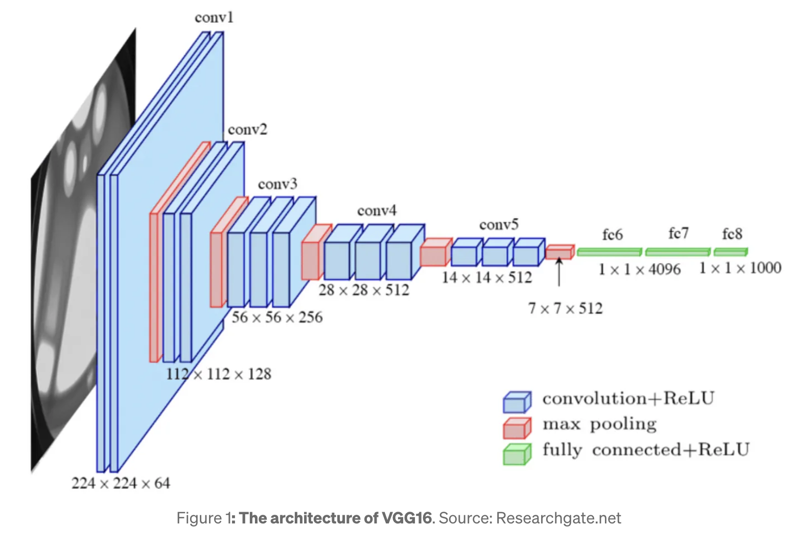

# VGG (2014)

## Paper Details and Authors
**Title:** Very Deep Convolutional Networks for Large-Scale Image Recognition  
**Authors:** Karen Simonyan, Andrew Zisserman  
**Publication:** Computer Vision and Pattern Recognition (CVPR) 2014  
**Institution:** Visual Geometry Group, Department of Engineering Science, University of Oxford  

## Original Paper
[Link to Original Paper](https://arxiv.org/abs/1409.1556)

## Summary of Key Contributions
VGG, named after the Visual Geometry Group at Oxford, represented a significant advancement in CNN architecture design by demonstrating the importance of network depth for performance in image recognition tasks. The paper's key contributions include:
- Showing that increasing network depth with very small (3×3) convolutional filters consistently improves performance on ImageNet classification.
- Providing a clear and systematic approach to CNN architecture design through depth scaling.
- Achieving state-of-the-art results on the ImageNet dataset (7.3% top-5 error for VGG-16 ensemble).
- Creating a network whose feature extractors transferred exceptionally well to other tasks and datasets.
- Establishing a simple and modular architecture pattern that became a standard reference design in computer vision.

The VGG networks, particularly VGG-16 and VGG-19, became some of the most widely used pre-trained models for transfer learning and feature extraction in the pre-ResNet era, with influence extending well beyond their initial image classification purpose.

## Architectural Details
VGG explored networks of increasing depth, from 11 layers (VGG-11) to 19 layers (VGG-19). All variants shared the same design principles:
- **Input:** Fixed-size 224×224 RGB images (with mean subtraction)
- **Convolutional Layers:** All using very small 3×3 filters with stride 1, padding 1 (to preserve spatial dimensions)
- **ReLU Activation:** After each convolutional layer
- **Pooling Layers:** 2×2 max-pooling with stride 2 (reducing dimensions by half)
- **Fully Connected Layers:** Three FC layers (4096, 4096, 1000 units) with the last being the softmax classifier
- **Regularization:** Dropout (0.5) applied to the first two FC layers

### VGG-16 Architecture
**Layer structure for VGG-16:**
- **Conv Block 1:** 2 conv layers with 64 filters, max pooling
- **Conv Block 2:** 2 conv layers with 128 filters, max pooling
- **Conv Block 3:** 3 conv layers with 256 filters, max pooling
- **Conv Block 4:** 3 conv layers with 512 filters, max pooling
- **Conv Block 5:** 3 conv layers with 512 filters, max pooling
- **Fully Connected:** 4096 units with dropout
- **Fully Connected:** 4096 units with dropout
- **Output:** 1000 units with softmax
  

## Key Innovations
- **Depth with Small Filters:** Demonstrated that stacking multiple 3×3 convolutions provides the same effective receptive field as larger filters (e.g., three 3×3 layers ≈ one 7×7 layer) while incorporating more non-linearities and using fewer parameters.
- **Homogeneous Architecture:** Used a consistent and systematic design pattern throughout the network, with clearly defined stages of computation.
- **Multi-Scale Training:** Introduced a multi-scale training approach where images were resized to different dimensions while maintaining aspect ratio.
- **Dense Evaluation at Test Time:** Improved accuracy by running the network on multiple crops and scales at test time and averaging predictions.
- **Scale Jittering:** Applied extensive data augmentation through scale variations during training.
- **Parameter Efficiency:** While large for its time (138M parameters for VGG-16), the design was more parameter-efficient than previous architectures for the depth achieved.
- **Transfer Learning:** The authors demonstrated that pre-trained VGG features transferred exceptionally well to other tasks, establishing a template for transfer learning in computer vision.

## Relationship to Vision Transformers
VGG and Vision Transformers represent different approaches to visual recognition, but VGG's contributions relate to ViTs in several important ways:
- **Architectural Simplicity:** VGG popularized the idea that simple, homogeneous architectures with clear design principles could outperform more complex, heterogeneous designs. ViTs follow this philosophy with their uniform Transformer encoder blocks.
- **Feature Hierarchy:** VGG demonstrated the power of learning hierarchical representations through progressive spatial downsampling. ViTs reimagine this concept through global self-attention within non-overlapping image patches, but hierarchical variants like Swin Transformer reintroduce this progressive feature learning.
- **Depth vs. Global Processing:** VGG achieved its receptive field gradually through depth, requiring many layers to capture global context. ViTs solve this limitation by enabling global interactions at each layer through self-attention, effectively addressing one of VGG's key constraints.
- **Transfer Learning Foundation:** VGG established pre-training and transfer learning as fundamental paradigms in computer vision. ViTs extend this concept to even larger scales with models pre-trained on vast datasets.
- **Parameter Scaling:** VGG showed that scaling model capacity through depth could improve performance, a principle that ViTs embrace through scaling both depth and width.
- **Memory Efficiency Trade-offs:** VGG's design prioritized simplicity at the cost of memory efficiency (storing all activations). Similarly, vanilla ViTs trade computational complexity for conceptual simplicity, though this has been addressed in subsequent ViT variants.

VGG's systematic approach to architecture design and its focus on simplicity and depth influenced the entire field of deep learning for computer vision, creating an intellectual path that eventually led to questioning whether convolutions were necessary at all—a question that ViTs would answer with their purely attention-based approach.

## Code Implementation

## Further Reading
For deeper insights into VGG and related architectures, refer to the following papers:
**Deep Residual Learning for Image Recognition**[https://arxiv.org/abs/1512.03385] (2015)- Introduced ResNet, which addressed the vanishing gradient problem in very deep networks like VGG.
**Return of the Devil in the Details: Delving Deep into Convolutional Nets** [https://arxiv.org/abs/1405.3531](2014)- A precursor to the VGG paper that explores CNN design principles.
**How transferable are features in deep neural networks?**[https://arxiv.org/abs/1411.1792] (2014)- Explores the transferability of features in deep networks like VGG.
**Two-Stream Convolutional Networks for Action Recognition in Videos** [https://arxiv.org/abs/1406.2199](2014)- Applies VGG-style networks to video recognition.

These papers provide a comprehensive understanding of the evolution of deep learning in computer vision.
